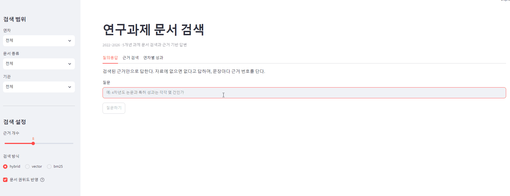

# Project Archive RAG  
### 다년도 연구과제 문서 아카이브 검색·질의응답 RAG 시스템 구현 

다년도 정부 R&D 과제의 보고서·회의록·성과자료를 검색해 **출처가 달린 답변**을
생성하는 RAG 시스템. 담당자 변경 시 과제 맥락 전달과 최종보고서 작성 지원 목적 (팀원 활용 및 인수인계)

과제는 **폐쇄망**(내부 연구망)에서 수행되어 문서 원문을 외부 API로 보낼 수 없음.
임베딩·생성을 전부 로컬 모델로 구성한 이유이자 이 시스템의 전제 조건.



수년치 문서는 형식(HWPX·PDF·PPTX·XLSX)과 폴더에 기록. NAS에 raw data 보존(test 후 link), 
인수인계·보고서 작성에서 실제로 필요한 질문("N차년도 목표는", "그 실험 결과 어디 있나")의 답은 표, 파일에 존재. 
특히 **수치는 LLM의 환각을 방지하기 위해**, 검색 품질 및 허용 범위 설계 필요 **-> 아래 적용 사례 및 설계**

검색 품질 문제 추적 위해 프레임워크(LangChain 등)를 쓰지 않고 파싱·청킹·검색·평가 구현

```
원본 문서 (PDF/HWPX/PPTX/XLSX/MD/HTML)
    │
    ├─ 파싱        src/parsers/      형식별 파서 → 공통 Block
    ├─ 정규화      src/text_norm.py  Kiwi 띄어쓰기 복원 · 형태소 토큰화
    ├─ 메타데이터  src/metadata.py   경로에서 연차·문서종류·날짜·기관 추출
    ├─ 청킹        src/chunker.py    양식 노이즈 제거 · 표 단위 보존
    │
    ├─ 색인        src/index.py      bge-m3 임베딩(Chroma) + BM25
    ├─ 검색        src/search.py     하이브리드(RRF) + 메타 필터 + 문서 권위도
    ├─ 정형화      src/perf_table.py 성과 표 → SQLite (수치 질문 전용)
    ├─ 생성        src/generate.py   Ollama / Anthropic 전환 가능
    │
    ├─ 산출        src/report_summary.py · export_excel.py · draft_report.py
    └─ 위키        src/wiki_build.py  인수인계 위키(Obsidian) 자동 생성

    평가          eval/run_eval.py           검색: 질문셋 기반 Hit@k · MRR
                  eval/grade_generation.py   생성: LLM-as-judge 정답률 · 기권 정밀도/재현율
```

## 핵심 설계 선택

| 선택 | 이유 | 근거 |
|---|---|---|
| 임베딩: `bge-m3` (한국어 특화 모델 교체) | 검색은 짧은 질문↔긴 문서의 비대칭 과제. 문장 유사도(KorSTS) 학습 모델은 벡터 비중을 높일수록 역효과 확인 | 사례 6 — Hit@8 64.7% → 88.2% |
| 하이브리드 검색 (BM25 + 벡터, RRF) | 수치·고유명사·과제번호는 BM25가, 의미 질의는 벡터가 강한 것 확인 | 결과 표 — BM25 단독 82.4% vs 하이브리드 88.2% |
| 문서 권위도 가중치 | 같은 내용이면 확정 보고서가 회의록보다 위에 와야 함 | MRR 0.512 → 0.612 (Hit@k 불변) |
| 청킹: 말단 표만 데이터 표, 표 단위 보존 | 정부 양식 HWPX는 바깥 표가 레이아웃임을 고려 본문이 나뉘도록 확인하며 청킹 | 사례 1·2 — 최대 청크 18,605자 → 1,382자 |
| k=8 | 상위 k가 전부 LLM 컨텍스트에 들어가므로 순위보다 포함(Hit@k)이 답변 품질을 좌우. 정답이 5~8위에 걸리는 질문이 3건 확인 | k 스윕 — Hit@3 70.6% / Hit@5 76.5% / Hit@8 88.2% |
| 수치 질문은 SQLite 조회로 우회 | 표 오독은 프롬프트로 절반만 해결. LLM에게 시키면 안 되는 일은 제외 | 사례 7·8 |
| 임베딩·생성 모두 로컬 | 폐쇄망 과제 — 원문의 외부 전송 자체가 불가. provider 교체는 config 한 줄 | 기술 스택 |

## 어떤 과제에든 적용되도록 범용적 설계

코드에는 특정 과제의 이름·기관·지표가 하드코딩되어 있지 않다. 과제 고유 정보는
전부 `config.yaml`의 `project` 섹션(placeholder 템플릿: [config.example.yaml](config.example.yaml))에서
읽도록 구성 [src/project.py](src/project.py)가 단일 진입점.

| config에 정의하는 것 | 코드가 하는 일 |
|---|---|
| 과제번호·과제명·기간(1차년도 연도, 총 연차 수) | 연차↔연도↔단계 매핑, LLM 프롬프트의 과제 구조 블록 생성 |
| 단계 구분 (1단계=1~3차년도 등) | "2단계 1차연도(2025)" 같은 표 열 이름을 과제 연차로 환산 |
| 참여기관 (역할·이름·별칭) | 문서 본문·파일명·성과표 셀에서 기관 소관 판정 |
| 성능지표 → 담당 기관 매핑 | 성과 정리 문서·UI의 "우리 기관 지표만" 필터 |
| 문서 종류별 권위도 | 확정 보고서를 회의록보다 위로 올리는 검색 가중치 |
| 색인 제외 문서 | 미작성 빈 양식 등 소스가 아닌 산출물 배제 |

새 과제에 적용하는 절차: ① `config.example.yaml`을 `config.yaml`로 복사해 project
섹션을 채운다 → ② `paths.sources`에 자료 폴더를 연결한다 → ③ 인제스트·색인 →
④ `eval/questions.yaml` 템플릿을 그 과제의 질문·정답으로 채워 검색 품질 확인.
명령어는 아래 [실행](#실행) 참고.

## 평가 파이프라인 — 검색과 생성을 따로 확인

검색이 정답을 찾아도 생성이 틀릴 수 있음(아래 사례 7). 그래서 두 단계를 분리.

**검색 평가** ([eval/run_eval.py](eval/run_eval.py)) — 질문셋의 정답 근거가 상위 k에
들어오는지. Hit@k와 MRR. 벤치마크 대신 **사람이 정답 위치를 먼저 확인한
질문셋을 수동 구성**한다(실제 적용은 21문항, 유형 5종 — fact/metric/compare/source/absent.
작성 요령은 [eval/questions.yaml](eval/questions.yaml) 템플릿 확인). 설정을 바꿀
때마다 같은 질문셋으로 회귀를 확인.

**생성 평가** ([eval/grade_generation.py](eval/grade_generation.py)) — 답변 자체를 채점.

- **정답률**: judge LLM이 답변을 기준 정답과 대조해 correct/partial/incorrect 판정
- **기권 정밀도/재현율**: 자료에 없는 질문(absent)에 "확인되지 않습니다"라고
  기권했는지 확인. 재현율이 낮으면 환각이고, 정밀도가 낮으면 과잉 기권
- **출처 표기율**: 답변에 근거 번호 [n]이 달렸는가 (규칙 검사)

채점 설계에서 지킨 것 세 가지. **기권 판정은 규칙 우선** - 기권 문구는 시스템
프롬프트가 강제하는 정형 표현이라 규칙이 LLM 판정보다 정확하고 재현 가능.
**judge와 생성 모델의 분리** - 같은 모델이 자기 답을 채점하면 관대해지는 편향이
있어, config의 `eval.judge`로 더 강한 모델을 지정할 수 있도록. **judge 자체를
검증 대상으로 취급** - 판정 근거(reason)를 함께 저장해 사람이 표본 대조할 수 있게
했고, 사람 채점과의 일치도가 확인되기 전까지 이 수치는 절대 지표가 아니라 **회귀 감지용**

---

## 적용 사례 — 실제 5개년 국가 R&D 과제

아래는 이 시스템을 실제 5개년 정부 R&D 과제에 적용하며 겪은 문제와 해결의
기록. 원본은 연차·단계보고서(HWPX), 회의록 원본 299개 파일(PPTX 186건과
PDF 변환본 등), 성과확인자료, 분석결과이고, 중복 형식 제거 후 **235개 문서**를
색인함(청크 3,243개). 기관명·과제 식별 정보는 익명화했고, **시스템 성능 수치(Hit@k, MRR,
청크 통계)는 실측값.** 과제의 성과 수치(논문·특허 건수, 지표 목표·실적값)는
기관 자료이므로 비공개 처리하고 판정 패턴(✓/✗)만 표시.

### 1. 한글 표가 레이아웃 컨테이너임을 확인

정부 양식 HWPX는 바깥 표가 페이지 레이아웃 역할을 함. 표를 곧이곧대로 추출하면
**본문 18,565자가 청크 하나**로 뭉침.

→ 중첩 표가 없는 **말단 표만 데이터 표**로 보고, 레이아웃 표는 통과해 내부 문단을
개별 블록화함. 501블록 중 최대 청크가 18,605자 → 1,382자로 정리.
[src/parsers/hwpx_parser.py](src/parsers/hwpx_parser.py)

### 2. 병합셀 때문에 성과표의 열이 어긋남

성과지표 표는 헤더가 3행에 걸쳐 있고 셀이 가로·세로로 병합돼 있음. 셀을 순서대로
읽으면 "4차년도 목표"가 어느 값인지 알 수 없음.

→ HWPX의 `cellAddr`(위치)·`cellSpan`(병합 범위)으로 **격자를 복원**

### 3. 표를 품은 문단이 표 내용을 중복 추출함

문단 안에 표가 들어 있는 구조라, 문단 텍스트를 뽑으면 표 내용이 딸려오고 같은 성과표가 `body`와 `table`로 두 번 색인됨

→ 문단 텍스트 추출 시 하위 표 영역을 건너뛰게 조치. 연차보고서 기준 96,794자 →
44,628자로 감소(중복분 제거). PDF도 같은 문제가 있어 표 bbox와 겹치는 텍스트
블록을 제외함.

### 4. PPT를 PDF로 변환한 문서는 띄어쓰기가 없음

변환 과정에서 공백 문자가 사라져 문장 전체가 붙어 나와 BM25에 취약
(핵심 키워드로 검색해도 매칭되지 않음)

→ 공백 비율로 자동 감지(정상 문서 0.10~0.17 vs 변환본 0.048)하고, 임계값 이하면
Kiwi로 복원 & **복원 후 토큰화** - 붙여 쓴 상태로 형태소 분석하면
합성 전문용어가 사라짐. [src/text_norm.py](src/text_norm.py)

### 5. 반복 양식이 검색 점수를 20배 부풀림

성과확인서는 성과 1건마다 같은 양식(과제정보 표 23회, 서명란 19회)이 반복됨.
RRF가 같은 텍스트의 점수를 전부 합산해, 이론상 최대 0.033이어야 할 점수가 0.58이 됨

→ 한 검색 목록 안에서 같은 텍스트는 **최고 순위 한 번만** 반영. 완전 동일 청크는
색인에서 제외. 30자 미만 의미 못찾은 조각도 제거. [src/search.py](src/search.py)

### 6. 임베딩 모델이 검색을 방해하는 정황

한국어 특화 모델(`ko-sroberta-multitask`)을 골랐는데, 평가셋을 돌려보니
**벡터 비중을 높일수록 성능이 떨어짐**.

| 벡터 비중 | 0.0 | 0.25 | 0.5 | 0.75 | 1.0 |
|---|---|---|---|---|---|
| ko-sroberta MRR | 0.618 | 0.575 | 0.540 | 0.528 | 0.520 |
| bge-m3 MRR | 0.618 | 0.607 | 0.612 | **0.615** | 0.605 |

원인은 학습 목적 불일치. ko-sroberta는 KorSTS(문장 유사도) 모델로 "두 문장이
비슷한가"를 학습했지만, 검색은 짧은 질문과 긴 문서를 잇는 비대칭 과제이므로 검색용으로 대조학습된 `bge-m3`로 교체 **Hit@8 64.7% → 88.2%**.

부수적으로 발견한 함정: ko-sroberta의 tokenizer는 `model_max_length=128`로 적혀
있지만 실제 모델은 512토큰까지 처리(`max_position_embeddings=514`)하기 때문에 그대로 두면 청크의 앞 1/4만 벡터에 반영되고, 지표상으로는 아무 문제 없어 보임
[eval/results.md](eval/results.md)

### 7. 검색이 정답을 찾아도 LLM이 표를 오독함

"4차년도 논문과 특허는 몇 건인가" - 정답 청크가 **검색 1위**였는데 답이 틀림

표의 열 이름이 `2단계 1차연도(2025)`인데 질문은 "4차년도"였다. 표에 "4차년도" 열이
없으니 LLM이 `계`(전체 누적) 열을 선택.

→ 두 단계로 해결. 프롬프트에 **과제 구조**(연차↔연도↔단계 매핑, "계 열은 누적값")를
주입하고, 성과 표를 **SQLite로 정형화**해 수치 질문에는 조회 결과를 함께 넣음.

| | 논문 | 특허 |
|---|---|---|
| 표만 제공 | 누적값 오답 ✗ | 오답 ✗ |
| + 과제 구조 | 정답 ✓ | 오답 ✗ |
| + 정형 데이터 | **정답 ✓** | **정답 ✓** |

프롬프트만으로는 절반만 해결됨. 나머지는 수치를 LLM에게 읽히지 않고 **조회로
답하도록** 조치. 검색 성능 회귀는 없음(Hit@8 88.2% 유지).

과제 구조 프롬프트는 지금 config의 project 섹션에서 자동 생성됨
([src/project.py](src/project.py)의 `prompt_context()`).
[src/perf_table.py](src/perf_table.py) · [src/perf_query.py](src/perf_query.py)

### 8. 자동 집계를 포기해야 하는 표도 존재함

정량성과표는 같은 표 안에서도 칸마다 표기가 다름

```
논문게재 | SCI(E) | 1(기관A)          ← 건수(기관)
기타     |        | 자문 보고서(1)설계서(1)   ← 이름(개수)
```

기계적으로 세면 틀리기 때문에 이런 표는 **집계하지 않고 원본 격자를 그대로** 엑셀로
내보내 사람이 판단하도록 함. 자동화의 경계를 고려해야 함
[src/export_excel.py](src/export_excel.py)

### 결과

**검색 품질** (평가셋 21문항 중 검색 평가 17문항, k=8 — 환각 확인용 absent 4문항은
생성 단계에서 따로 평가)

| | Hit@8 | MRR |
|---|---|---|
| 초기 (ko-sroberta 하이브리드) | 64.7% | 0.520 |
| **bge-m3 하이브리드 + 문서 권위도** | **88.2%** | **0.612** |
| 참고: BM25 단독 | 82.4% | 0.618 |

수치는 문서 권위도 도입 시점 측정값. 이후 PDF·PPTX 표 인식을 추가해 청크가
늘면서 MRR 0.607로 소폭 내려갔고(Hit@8은 88.2% 유지), 정형 수치 추출이 가능해진
이득이 더 컸음 - 시점별 전체 로그: [eval/results.md](eval/results.md).

유형별로는 성과 수치 5/5, 기관 소관 3/3, 단순 사실 5/6, 연차 비교 2/3.
문서 권위도 가중치(연차보고서 1.35 / 회의록 0.85)는 Hit@k는 그대로 두고
MRR을 0.512 → 0.612로 개선

### 실패 사례 — 남아 있는 것

- **양식 문구 오염** - "주관·공동연구개발기관은 각각 어디인가": 서명란 안내문
  ("주관연구개발기관의 장과 공동연구개발기관의 장…")이 질의어를 그대로 포함해
  BM25 최상위를 차지함. 노이즈 필터에 문구를 추가해도 순위가 바뀌지 않았음.
- **어휘 중첩 없음** — "1단계와 2단계의 사업 기간": 정보가 성과표 헤더
  ("1단계(2022~2024)")에만 있어 질의와 겹치는 어휘가 거의 없음.
- **표 오독(생성 단계)** — 검색이 정답을 1위로 찾아도 표 열 이름이 질문과 어긋나면
  LLM이 누적 열을 선택함. 이것은 사례 7의 정형화로 해결했음.

앞의 두 건은 재순위화(reranker) 도입으로 개선을 시도할 유형.
실패 전수와 원인 분석: [eval/results.md](eval/results.md)

### 과제 종료 후 — RAG를 인터페이스에서 파이프라인으로 재배치

과제가 종료되어 문서가 더 이상 변하지 않게 되자 문제는 "어떻게 잘
검색·생성하나"에서 "**매번 생성할 이유가 있나**"로 바뀜. 겪은 수치 오류는 전부
LLM이 같은 표를 매번 새로 해석하면서 생기기 때문에 내용이 고정되면 한 번 검증해 고정하는 쪽이 안정적임

그래서 RAG를 최종 인터페이스가 아니라 **인수인계 위키(Obsidian) 생성
파이프라인**으로 재배치 ([src/wiki_build.py](src/wiki_build.py)).

```
RAG (도구)                                 wiki (산출물)
───────────────────────────────────────────────────────────
성과 표 정형화(SQLite)  →  자동 생성   →  성과 페이지 (연차 요약·지표 이력·성과 목록)
경로 메타데이터         →  자동 생성   →  자료 색인 (문서 전체의 지도)
검색·초안 생성          →  사람 검증   →  연차별 수행내용 (검증 후 고정)
```

자동 생성 페이지는 frontmatter `generated: true`로 표시되고 재생성 시 그 페이지만
교체됨 - **사람이 검증한 페이지는 파이프라인이 건드리지 않는다.** RAG는 남는
곳에만 남김: 회의록 1,632청크의 내용 검색. 

## 실행

```bash
conda env create -f environment.yml && conda activate project-archive-rag
cp config.example.yaml config.yaml   # project 섹션과 sources를 채운다

python src/ingest.py -s      # 파싱 → 청킹 → storage/chunks.jsonl
python src/index.py          # 임베딩 + BM25 색인
python src/perf_table.py     # 성과 표 → SQLite

python src/search.py         # 대화형 검색 (LLM 없이)
python src/generate.py       # 대화형 질의응답 (Ollama 필요)
python eval/run_eval.py --compare        # 검색 설정 비교
python eval/grade_generation.py --save   # 생성 품질 자동 채점
streamlit run app.py         # 웹 UI
```

## 기술 스택

| 영역 | 선택 | 이유 |
|---|---|---|
| 파싱 | PyMuPDF, python-pptx, openpyxl, lxml | HWPX는 ZIP+XML이라 표준 라이브러리로 처리 |
| 한국어 | kiwipiepy | 띄어쓰기 복원 + BM25 형태소 토크나이저 |
| 임베딩 | BAAI/bge-m3 (로컬) | 검색 전용 학습. 원문이 외부로 나가지 않는다 |
| 벡터 DB | Chroma (임베디드) | 폴더 하나로 백업·이전 가능 |
| 키워드 | rank-bm25 | 수치·고유명사 검색에 강함 |
| 생성 | Ollama + 로컬 LLM | 로컬 추론. provider 교체 가능 |
| 정형 데이터 | SQLite | 성과 수치는 LLM 요약이 아닌 조회로 |

과제가 폐쇄망에서 진행되어 문서 원문을 외부 API로 보낼 수 없으므로 임베딩·생성
모두 로컬에서 진행. 보안 제약이 없는 환경이라면 `config.yaml`의 `provider`를
바꾸는 것만으로 상용 API로 전환됨(코드 변경 없음).

## 한계

- 평가셋 21문항, 단일 작성자. 새로운 유형의 오류에 대한 일반화는 검증되지 않음.
- 설정 비교는 임베딩 모델·RRF 벡터 비중·문서 권위도·top-k에 한정됨.
  청크 크기 민감도는 재지 않았음.
- 재순위화(reranker) 미도입 — 남은 검색 실패 2건이 이 유형(어휘 중첩이 없는
  질문·양식 문구 오염). [eval/results.md](eval/results.md) 참고.
- 생성 자동 채점(grade_generation.py)의 judge 판정은 아직 사람 채점과의 일치도가
  검증되지 않았음. 적용 당시 환각 확인(absent) 4문항은 자동 채점 없이 사람이
  직접 확인. judge 일치도 검증 전까지 자동 채점 수치는 회귀 감지용으로만 사용.

## 데이터 취급

실제 과제 자료와 산출물은 이 저장소에 포함되지 않는다(`.gitignore`).
`config.yaml`(실제 과제 정보)도 커밋되지 않으며, 저장소에는 placeholder 템플릿만
있음. `src/`의 코드는 특정 과제에 종속되지 않는 범용 파이프라인.

이 저장소는 포트폴리오 목적의 **열람·참고용**으로 공개한다. 별도 라이선스를
부여하지 않으며, 재사용이 필요하면 문의할 것.
